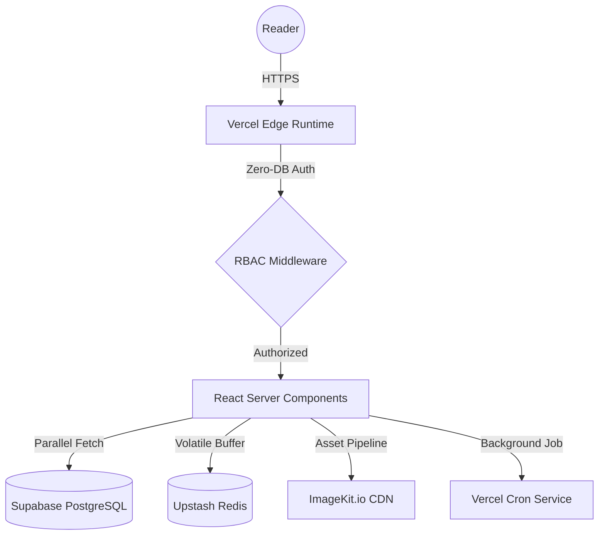

# Absolute Encyclopedia: Ruang Aksara Platform (The Ultra-Definitive Reference)

This is the definitive, high-density technical record for Ruang Aksara—a digital sanctuary and multi-role literary orchestration system. This document serves as the root index for the entire architectural suite, now expanded to a globally competitive technical standard.

## 1. Proprietary Status & Sovereign Licensing
**Legal Status**: PRIVATE / PROPRIETARY (Sovereign Repository)
**License**: UNLICENSED (All Rights Reserved)
**Copyright**: © 2026 Ruang Aksara Technical Team (Camn0 & 4-Author Collective)
**Strict Prohibitions**: This codebase is a proprietary creative instrument. Unauthorized forking, scraping, redistribution, or derivation of any content or logic contained herein is strictly prohibited under international copyright law.

## 2. Infrastructure & Data Orchestration

Ruang Aksara is engineered on the Next.js 14 App Router, utilizing a modern serverless stack that prioritizes "The Sanctuary Feel" (Focus and Speed).

## 3. The Definitive Technical Module Suite

Each module below has been ultra-expanded to provide exhaustive technical detail, rationales, and architectural blueprints for the co-authoring team.

### 3.1 [Architecture & Infrastructure](docs/ARCHITECTURE.md)
A sub-millimeter deep dive into the Quaternary Caching Taxonomy, the Server-First rendering paradigm (RSC), and the "Write-Behind" Redis-to-PostgreSQL synchronization patterns.

### 3.2 [Features & Functional Mechanics](docs/FEATURES.md)
Logic specifications for the "Reader Sanctuary" (Immersive UI, HSL Theme persistence) and the "Author Studio" (Markdown sequencing, 30s Anti-Cheat thresholds, and behavioral gamification).

### 3.3 [Social Engine & Engagement](docs/SOCIAL_ENGINE.md)
A technical record of recursive threading algorithms, metadata-delimited notification parsing, and atomic aggregate rating synchronization logic.

### 3.4 [Database Model & Schema](docs/DATABASE_SCHEMA.md)
Exhaustive field-by-field specifications, composite unique indexing strategies for sequential narrative integrity, and cascading referential integrity rules.

### 3.5 [API, Actions & Revalidation](docs/API_AND_ACTIONS.md)
Mutable state-transfer documentation. Covers standardized Server Action lifecycles, global revalidation tag maps, and the internal Vercel Cron heartbeat protocol.

### 3.6 [Security & RBAC Protection](docs/SECURITY_AND_ROLES.md)
Authorization matrices detailing the Zero-DB authorization claims flow, Edge Middleware enforcement, and action-level identity hardening.

### 3.7 [Asset Management & Media Pipeline](docs/ASSET_MANAGEMENT.md)
Details the ImageKit.io CDN pipeline, responsive HSL-auto transformation logic, and the secure direct-to-CDN asset injection workflow.

### 3.8 [Maintenance & Deployment Guide](docs/MAINTENANCE.md)
Operational handbook for CI/CD routines, Postgres connection pooling (PgBouncer), and the automated database keep-alive strategy.

## 4. Engineering Directory Map

| Path Namespace | Primary Technical Priority | Logic Root |
| --- | --- | --- |
| `/app/novel/[id]` | Immersive Rendering | `ReadingInterface.tsx` |
| `/app/studio` | Content Orchestration | `ChapterEditor.tsx` |
| `/app/actions` | Secure Data Mutation | `user.ts`, `chapter.ts` |
| `/app/api/cron` | Background Persistence | `sync-views/route.ts` |
| `/prisma` | Structural Integrity | `schema.prisma` |
| `/lib` | Infrastructure Setup | `prisma.ts`, `auth.ts` |
